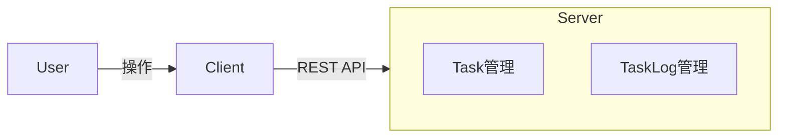
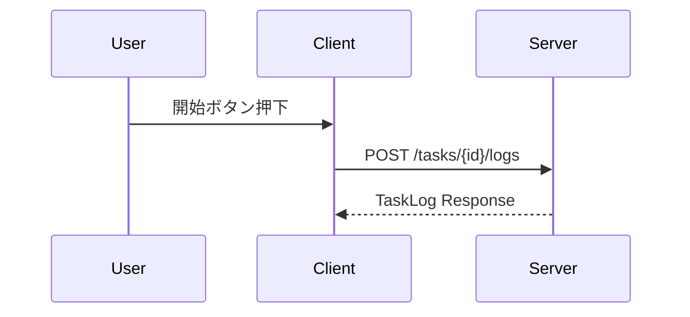

# Taskio Use Cases

> **Status:** Draft（更新前提）  
> 本ドキュメントは、現時点で合意された方針・実装状況をもとに作成されたユースケース定義である。  
> 実装の進行や要件変更に応じて、随時更新されることを前提とする。

---

## 1. 前提・方針

- 本アプリは **個人利用向けタスクログ管理アプリ** とする
- 初期段階では以下を前提とする
  - ユーザー認証なし（シングルユーザー）
  - 永続化なし（in-memory）
  - Android クライアントを主軸に、将来的に Web クライアント対応
- タスクは「やる／やらない」ではなく、**「いつ・どれくらい実行したか」** を記録することを重視する

---

## 2. アクター定義

| アクター | 説明 |
|---|---|
| User | Taskio を利用するユーザー（本人） |
| Client App | Android / Web クライアント |
| Server | Rust + Axum による API サーバー |

---

## 3. 全体ユースケース図

---

## 4. ユースケース一覧

### UC-01 タスクを作成する

| 項目 | 内容 |
|---|---|
| 主アクター | User |
| 目的 | 新しいタスクを登録する |
| トリガー | タスク作成画面で保存操作 |
| 事前条件 | アプリが起動している |
| 事後条件 | タスクがシステムに登録される |

#### 基本フロー

1. User がタスク作成画面を開く
2. タイトル（必須）、説明（任意）を入力
3. 保存ボタンを押下
4. Client が Server にタスク作成 API を送信
5. Server がタスクを生成し、結果を返却
6. Client が作成結果を表示

---

### UC-02 タスク一覧を確認する

| 項目 | 内容 |
|---|---|
| 主アクター | User |
| 目的 | 登録済みタスクを確認する |
| トリガー | アプリ起動／一覧画面表示 |

#### 基本フロー

1. Client がタスク一覧取得 API を呼び出す
2. Server がタスク一覧を返却
3. Client が一覧として表示

---

### UC-03 タスクを開始する（ログ作成）

| 項目 | 内容 |
|---|---|
| 主アクター | User |
| 目的 | タスクの実行開始を記録する |
| トリガー | 「開始」ボタン押下 |
| 事前条件 | 対象タスクが存在する |
| 事後条件 | TaskLog が作成される |

#### 基本フロー

1. User がタスク詳細画面を開く
2. 「開始」ボタンを押下
3. Client が TaskLog 作成 API を呼び出す
4. Server が開始時刻付きの TaskLog を生成
5. Client が実行中状態を表示

---

### UC-04 タスクを終了する（ログ更新）

| 項目 | 内容 |
|---|---|
| 主アクター | User |
| 目的 | タスクの実行終了を記録する |
| トリガー | 「終了」ボタン押下 |
| 事後条件 | TaskLog に終了時刻が設定される |

#### 基本フロー

1. User が実行中タスクの「終了」ボタンを押下
2. Client が TaskLog 更新 API を呼び出す
3. Server が終了時刻を設定
4. Client が完了状態を表示

---

### UC-05 タスクログを確認する

| 項目 | 内容 |
|---|---|
| 主アクター | User |
| 目的 | 過去の実行履歴を確認する |
| トリガー | タスク詳細画面表示 |

#### 基本フロー

1. Client が対象タスクのログ一覧 API を呼び出す
2. Server が TaskLog 一覧を返却
3. Client が時系列で表示

---

## 5. 例外・補足

- 同一タスクに対する同時実行は現時点では制御しない
- 入力値バリデーションは最小限とする
- エラー詳細は API レスポンスとして返却する

---

## 6. 今後の拡張（想定）

- 実行中タスクの制御強化（同時実行防止）
- 実行時間の集計・可視化
- 認証導入後のマルチユーザー対応

---

## 7. 更新方針

- 本ドキュメントは **Draft** として管理する
- 実装変更・仕様追加時に更新する
- 正本は GitHub リポジトリ内の本ファイルとする
